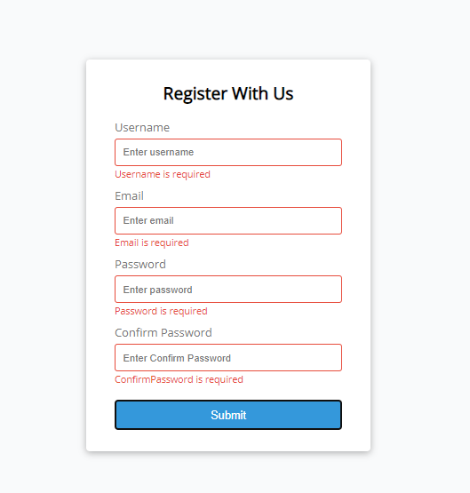

## DOM Form Validator 

>Create a validition form use Document Object Model(DOM).

> Use fo check all inputs and confirm that:
1. Not empty
2. Email is valid
3. Input length
4. Password and Confirm Password is a match

## The Form

## Show Error

